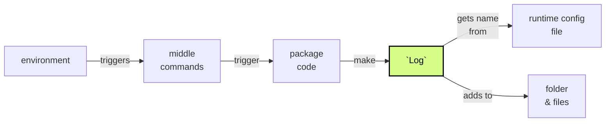
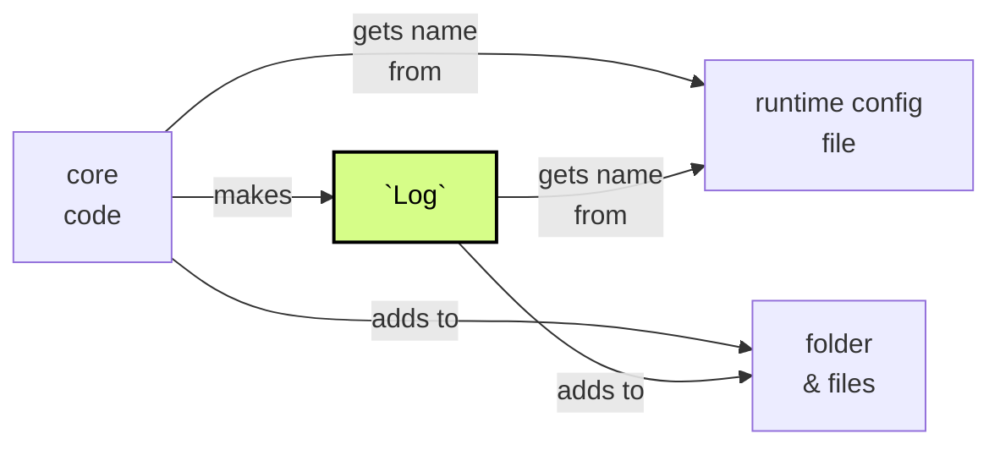
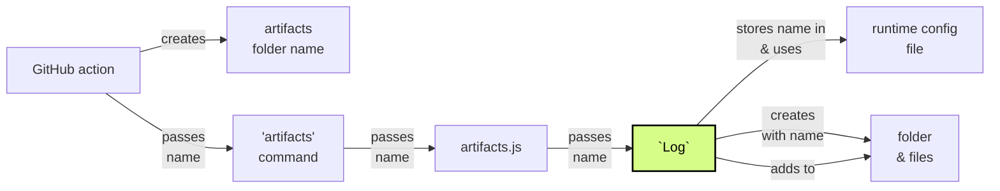
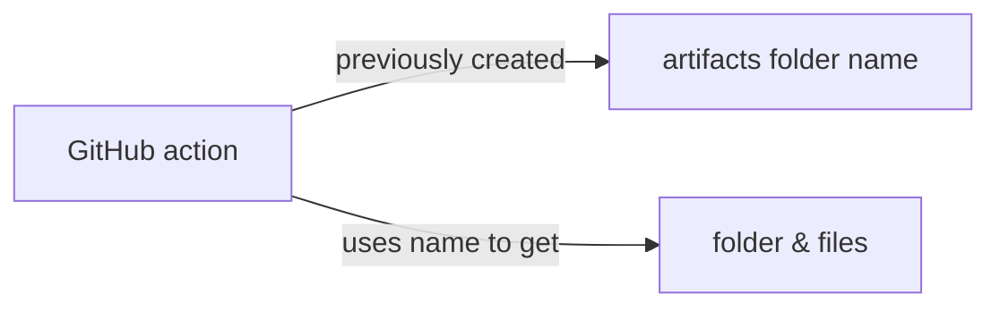
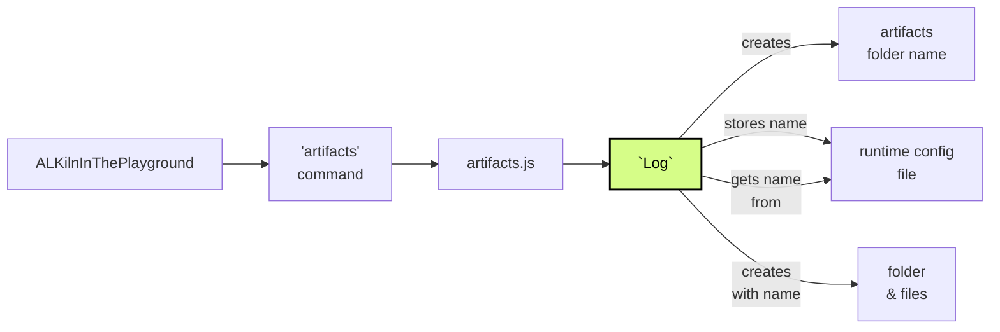
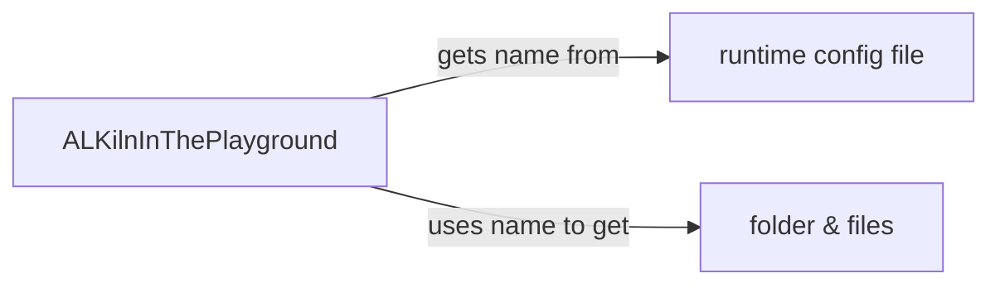
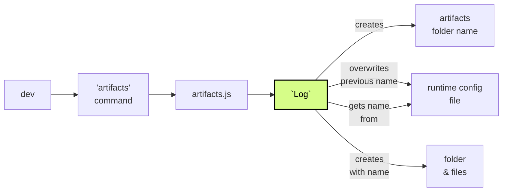
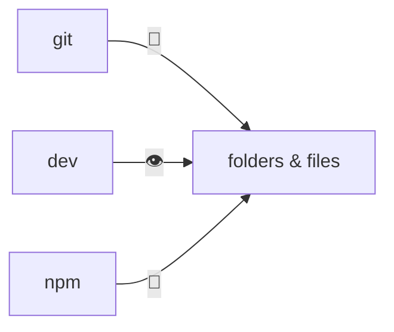

# Creating and using the name of the artifacts folder

## Context and scope

The artifacts folder is where an author can see the results of their tests, like the reports, screenshots, and downloaded documents.

The name of this folder has a specific format to make it as short as possible while it still stays recognizable to users and that it is unique. To help keep it unique it includes a timestamp. (The human readable date/time is not as precise and also longer than the timestamp).

Because of the 4 environments ALKiln can run in (see the docs about the 4 environments), we have different ways to make sure we use one unique artifacts folder name for each test run.

## Goals

- Minimize code duplication
- In each of the 4 ALKiln environments, be able to track one unique folder name for each test suite run

## The actual design

Our 4 environments can be condensed into 3 environments for the purpose of managing the artifacts folder name:

- GitHub action (`./action.yml`)
- ALKilnInThePlayground
- The command line for internal development

Every environment runs npm commands. Those commands are sometimes run separately and thus trigger separate processes. We must find a way to persist information, like the name of the artifacts folder, across these processes.

The GitHub action creates an artifact folder name and sends it to a script that use an instance of the `Log` class to create the folder and save the name. In other environments, an instance of the `Log` class is what creates the name.

The instance of the `Log` saves the name in `runtime_config.json`. That instance of `Log` and other ALKiln code uses that name to create and store files in that artifacts folder.

The artifact folder name generation code is in 2 places - the GitHub action and ALKiln's core code[^1]. In future, we may be able to reduce that to just one location - the core code.

Below are more detailed descriptions of how each environment interacts with the folder name. Where the folder name is created, gets passed, gets saved, and gets used. These descriptions still gloss over many details.

The diagrams highlight `Log` to help visualize a common point in all the flows.

### Shared behavior

For each environment, the start and end of how they manage the artifacts folder name is different. In the middle, though - once the artifacts folder name is already stored in the `runtime_config` file - the flow is the same.

Npm commands that come in the middle have this flow to save logs:

The core code also needs to use the artifacts folder name in order to save both logs and other artifacts:

Those are the shared flows. Each environment, though, has its own way to store the name at the start and each environment has its own way to give the author the final artifacts.

### GitHub action

The GitHub action starts off with an empty `runtime_config` file. The action creates a new folder name and passes that name to the `artifacts` script, which passes that name to a `Log`. The `Log` creates the artifacts folder and saves the name in `runtime_config.json`.

Then other processes use the name from the config to store logs and other files in the artifacts folder (as we've already shown).

Finally, the action uses the name in the action context to download the artifacts folder so the user can have access to it after the action is done.

### ALKilnInThePlayground

_Note: This should be implemented by the time anyone actually reads this. Here's hoping._

ALKilnInThePlayground starts off with an empty `runtime_config` file. ALKilnInThePlayground triggers the `artifacts` command, but without a folder name. The code still creates a `Log` (also without a folder name). The `Log` itself creates the name.

Then other processes use the name from the config to store logs and other files in the artifacts folder (as we've already shown).

Finally, ALKilnInThePlayground itself uses the runtime config file to get the name so it can give the artifacts to the user.

### Command line

The command line flow is similar to ALKilnInThePlayground, but has to deal with a pre-existing runtime config file[^2]. The command line flow overwrites the artifacts folder name on each run.

An internal developer uses the command line to trigger the `artifacts` command, but without a folder name. The code still creates a `Log` (also without a folder name). The `Log` itself creates a name and overwrites the current name in the runtime config file.

Then other processes use the name from the config to store logs and other files in the artifacts folder (as we've already shown).

ALKiln stores the artifacts folder in the root of the local repository folder. The developer has direct access to the file system and can see every new artifacts folder. In fact, they can also see any previous artifacts folders. We avoid adding those artifacts folders to the repo by including the folder name pattern in the `.gitignore` and `.npmignore` files.

## Alternatives considered

- Each originator (GitHub, ALKilnInThePlayground, the dev) could always create the name from the outside. This would duplicate work, but would give more fine-grained control.
- Have `Log` make a different folder name each time and, at the very end, combine the contents of those folders into one folder. Hey, all ideas are welcome here.

For name creation:

- Avoid GitHub actions creating names. That is, create names only in `artifacts.js` and pass that out again. Needs research.

[^1]: **Core framework code/core code:** the code that implements the Steps in the `.feature` test files.

[^2] Keeping the `runtime_config` file around helps greatly improves the local development experience. You can read more in the document that talks about the 4 environments ALKiln supports.
