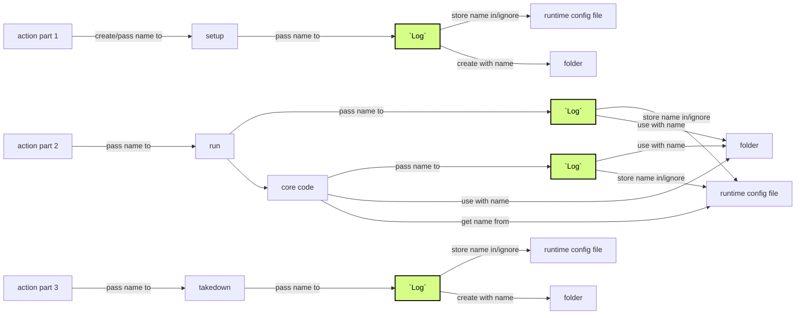
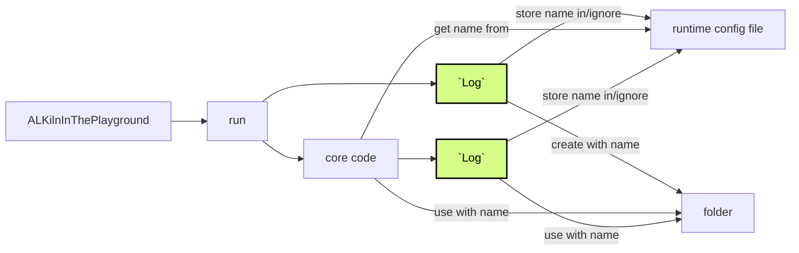
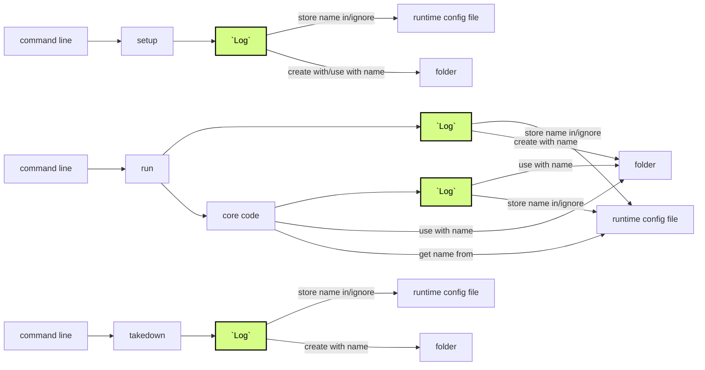

# Creating and using the name of the artifacts folder

## Context and scope

The artifacts folder is where an author can see the results of their tests, like the reports, screenshots, and downloaded documents.

The name of this folder has a specific format to make it as short as possible while it still stays recognizable to users and that it is unique. To help keep it unique it includes a timestamp. (The human readable date/time is not as precise and also longer than the timestamp).

Because of the 4 environments ALKiln can run in (see the docs about the 4 environments), we have different ways to make sure we use one unique artifacts folder name for each test run.

## Goals

- Minimize code duplication
- In each of the 4 ALKiln environments, be able to track one unique folder name for each test suite run

## The actual design

Our 4 environments can be condensed into 3 environments for the purpose of managing the artifacts folder name:

- GitHub action (`./action.yml`)
- ALKilnInThePlayground
- The command line for internal development

The GitHub action creates an artifact folder name and sends it to various scripts that use an instance of the `Log` class to create the folder and save the name. In other environments, an instance of the `Log` class both creates the name, creates the folder, and saves the name. The instance of the `Log` saves the name in `runtime_config.json`. That instance of `Log` and other ALKiln code uses that name to create and store files in that artifacts folder.

The artifact folder name generation code is in 2 places - the GitHub action and ALKiln's core code[^1]. In future, we may reduce that to just one location - the core code.

<!-- More complex description that I don't think we need now, but want to double check:
The scripts that GitHub action uses need to store its output in the same artifacts folder. The GitHub action therefore builds the name of the artifact folder and passes that around to the different scripts. The scripts pass the folder name to the `Log` class every time, which saves the folder name in `runtime_config.json`. After that, the core code uses that `json` value to put other artifacts in the same folder. We also have folder-naming code in the core code which we use for other purposes. The GitHub action duplicates that folder-naming code, which is unfortunate.

At the same time, tests that run in ALKilnInThePlayground don't have GitHub to manage the artifact folder name. It only uses the `run_cucumber` script, not any of the others...

Adding to that confusion, when people (like internal ALKiln developers) run tests from their command line, they do use the `setup` script once at first, but then run test suites repeatedly...

Neither of the last 2 can depend on the `runtime_config.json` folder name that `setup` creates. If they did, all their multiple test runs would save to that first folder. Since both those environments use `run_cucumber.js` alone repeatedly, and since we don't want to duplicate folder-naming behavior between even more scripts, we decided that those non-GitHub environments should be able to let `Log` create a folder name from scratch every time. The `Log` constructor has to be able to accept a `path` argument with a folder name and also to accept an undefined `path` argument.
-->

A future goal is to remove the need to store the name in the runtime configuration file to reduce that complexity a bit. These flows are up for discussion.

Below are more detailed descriptions of the different paths the folder name takes in the different environments. Where the folder name is created, gets passed, gets saved, and gets used. Note that there's a little glossing over the details. For example, everything saves to `runtime_config.json`, but only the core code[^1] ever uses the value there.

The diagrams highlight `Log` to help visualize a common point in all the flows.

### GitHub action

1. GitHub action creates a new folder name, passes that name to `setup`, which passes that name to `Log`, which creates the artifacts folder and saves the name in `runtime_config.json`. The setup `Log` uses the name to store logs in the folder. The setup uses its `Log`.
2. GitHub action uses the same folder name, passes that same name to `run_cucumber`, which passes that same name to `Log`. The `runtime_cucumber` process uses that `Log`. The `run_cucumber` process also triggers the core code, which uses the folder name in `runtime_config.json` to create its own `Log`. The core code also uses that name to store other artifact files in the folder.
3. GitHub action creates the folder name, passes that same name to `takedown`, which passes that same name when instantiating its `Log`. The takedown `Log` uses the name to store logs in the folder.

### ALKilnInThePlayground

1. ALKilnInThePlayground triggers `run_cucumber` without a folder name which triggers `Log` without a folder name. `Log` creates a new folder name and saves it in `runtime_config.json`. It also creates the artifacts folder. The `run_cucumber` process also triggers the core code, which uses the folder name in `runtime_config.json` to create its own `Log`. The core code also uses that name to store other artifact files in the folder.

### Command line

1. The developer uses the command line to trigger setup without a folder name which triggers `Log` without a folder name. `Log` creates a name and creates the artifacts folder, then stores files in that folder.
2. The developer uses the command line to trigger `run_cucumber` without a folder name which triggers `Log` without a folder name. `Log` creates and saves a new folder name in `runtime_config.json`, and creates the artifacts folder.  The `run_cucumber` process also triggers the core code, which uses the folder name in `runtime_config.json` to create its own `Log`. The core code also uses that name to store other artifact files in the folder.
3. The developer uses the command line to trigger `takedown` without a folder name which triggers `Log` without a folder name. `Log` creates a name and the artifacts folder, then stores files in that folder.

## Alternatives considered

- One script for creating the artifacts folder name: Make a script that saves the folder name to the ALKiln `runtime_config.json`. Then all the other code, including instances of `Log`, would always use `runtime_config.json`. We would want `package.json` scripts for the command line environment that would include getting the name of the folder. That potentially complicates the code and process for internal development. We will see how our current design behaves first.
- Use `Log`'s path name instead of the one in `runtime_config.json`. We thought we would want to save in previous artifacts folders, but it now seems potentially unnecessary. This seems the most viable option for the future, but it is unclear how we can integrate `Log` with all the other files. I wouldn't consider PDFs and screenshots to be logs.

[^1]: **Core framework code/core code:** the code that implements the Steps in the `.feature` test files.
